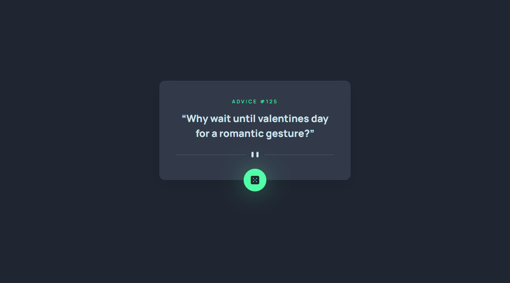

# Frontend Mentor - Advice generator app

This is a solution to the [Advice generator app](https://www.frontendmentor.io/challenges/advice-generator-app-QdUG-13db). Frontend Mentor challenges help you improve your coding skills by building realistic projects.

## Table of contents

- [Overview](#overview)
  - [The challenge](#the-challenge)
  - [Screenshot](#screenshot)
  - [Links](#links)
- [My process](#my-process)
  - [Built with](#built-with)
  - [What I learned](#what-i-learned)
  - [Continued development](#continued-development)
  - [Useful resources](#useful-resources)
- [Author](#author)
- [Acknowledgments](#acknowledgments)

## Overview

### The challenge

Users should be able to:

- View the optimal layout for the app depending on their device's screen size
- See hover states for all interactive elements on the page
- Generate a new piece of advice by clicking the dice icon

### Screenshot

_Desktop version_



### Links

- Repository URL: [https://github.com/miranlegin/fem-advice-generator](https://github.com/miranlegin/fem-advice-generator)
- Solution URL: [https://www.frontendmentor.io/solutions/roll-the-dice-to-generate-the-advice-Z_UTLt34Dn](https://www.frontendmentor.io/solutions/roll-the-dice-to-generate-the-advice-Z_UTLt34Dn)
- Live Site URL: [https://frontend-mentor-challenge09.netlify.app/](https://frontend-mentor-challenge09.netlify.app/)

## My process

### Built with

- SVG icons
- SCSS
- CSS animations
- async/await fetch

### What I learned

I've used this example to practice with fetching data from API and handling it on the front with some custom CSS animations.

Used `q` here for quotes

```html
<q><span class="quote"></span></q>
```

Tailwind **sr-only** class

```css
.sr-only {
  position: absolute;
  width: 1px;
  height: 1px;
  padding: 0;
  margin: -1px;
  overflow: hidden;
  clip: rect(0, 0, 0, 0);
  white-space: nowrap;
  border-width: 0;
}
```

Using cache to solve Firefox caching issue with fetch

```js
const response = await fetch(url, { cache: 'no-cache' });
```

### Continued development

There are some things that can be made better and practice more with this example. I didn't incorporate error handling if fetch functions. There are some other ways to fetch from API like .then etc.. Also there are some improvements that can be made with animating height if next advice it taller/smaller.

### Useful resources

- [sr-only utility class](https://tailwindcss.com/docs/screen-readers) - Find this one when i was on the search for sr-only utility class. Probably they've done better job than i would do.
- [async/await with fetch](https://dmitripavlutin.com/javascript-fetch-async-await/) - This is an amazing article which helped me finally understand XYZ. I'd recommend it to anyone still learning this concept.
- [sync/await with fetch](https://rapidapi.com/guides/fetch-api-async-await#using-asyncawait)
- [fetch api options object](https://javascript.info/fetch-api#cache)

## Author

- Frontend Mentor - [@miranlegin](https://www.frontendmentor.io/profile/miranlegin)

## Acknowledgments

Thanks to [Elaine](https://www.frontendmentor.io/profile/elaineleung) for pointing me to the problem i didn't know i had and providing me with right solution: [comment](https://www.frontendmentor.io/solutions/roll-the-dice-to-generate-the-advice-Z_UTLt34Dn#comment-631d1def84afb78b1732578a)
